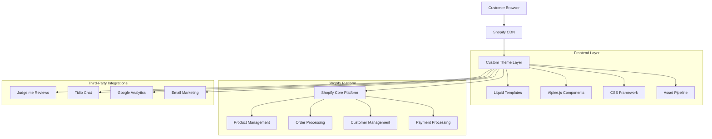
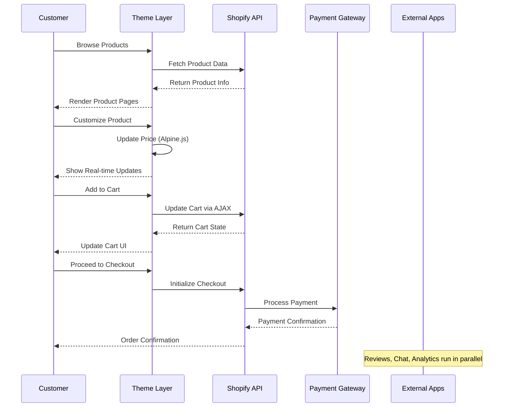

# Design Document

## Overview

This design document provides a comprehensive technical blueprint for the "Kala Aabharanam" e-commerce platform. The design leverages Shopify's robust infrastructure while creating a premium, culturally-rich shopping experience that meets all functional and non-functional requirements outlined in the requirements document.

The architecture follows a Platform-as-a-Service (PaaS) model, utilizing Shopify's Online Store 2.0 framework for maximum flexibility and maintainability. The design emphasizes performance, accessibility, and brand consistency while providing robust customization capabilities and seamless user experiences across all devices.

## Architecture

### High-Level System Architecture



### Technology Stack Decision Matrix

| Component             | Technology              | Rationale                                                                   |
| --------------------- | ----------------------- | --------------------------------------------------------------------------- |
| **Platform**          | Shopify Basic           | Cost-effective e-commerce with built-in security, payments, and scalability |
| **Theme Framework**   | Online Store 2.0        | Modern, flexible architecture with JSON templates and section groups        |
| **Frontend Language** | Liquid + HTML5          | Native Shopify templating with semantic markup                              |
| **Styling**           | CSS3 + Custom Framework | Performance-optimized custom CSS using BEM methodology                      |
| **Interactivity**     | Alpine.js               | Lightweight (15KB) reactive framework, perfect for e-commerce interactions  |
| **Build Process**     | Shopify CLI             | Official tooling for development, testing, and deployment                   |
| **Performance**       | Native Shopify CDN      | Global content delivery with automatic optimization                         |

### Data Flow Architecture



## Components and Interfaces

### Core Theme Structure

```
kala-aabharanam-theme/
├── assets/
│   ├── application.css          # Main stylesheet
│   ├── application.js           # Main JavaScript
│   ├── alpine.min.js           # Alpine.js framework
│   └── images/                 # Brand assets
├── config/
│   ├── settings_schema.json    # Theme customization options
│   └── settings_data.json      # Default theme settings
├── layout/
│   └── theme.liquid            # Master layout template
├── locales/
│   └── en.default.json         # Internationalization strings
├── sections/
│   ├── header.liquid           # Site navigation
│   ├── footer.liquid           # Site footer
│   ├── hero-banner.liquid      # Homepage hero
│   ├── featured-collection.liquid # Product collections
│   ├── product-grid.liquid     # Product listing
│   ├── testimonials.liquid     # Customer reviews
│   └── newsletter.liquid       # Email signup
├── snippets/
│   ├── product-card.liquid     # Individual product display
│   ├── product-form.liquid     # Add to cart functionality
│   ├── cart-drawer.liquid      # Shopping cart sidebar
│   ├── price.liquid            # Price formatting
│   └── icon.liquid             # SVG icon system
├── templates/
│   ├── index.liquid            # Homepage
│   ├── collection.liquid       # Category pages
│   ├── product.liquid          # Product detail pages
│   ├── cart.liquid             # Shopping cart page
│   ├── page.liquid             # Static pages
│   ├── blog.liquid             # Blog listing
│   ├── article.liquid          # Blog posts
│   └── customers/              # Account pages
└── docs/
    └── README.md               # Development documentation
```

### Layout Components

#### Master Layout (theme.liquid)

```liquid
<!doctype html>
<html class="no-js" lang="{{ request.locale.iso_code }}">
<head>
  <meta charset="utf-8">
  <meta http-equiv="X-UA-Compatible" content="IE=edge">
  <meta name="viewport" content="width=device-width,initial-scale=1">

  <!-- Performance optimizations -->
  <link rel="preconnect" href="https://cdn.shopify.com" crossorigin>
  <link rel="dns-prefetch" href="https://productreviews.shopifycdn.com">

  <!-- SEO and meta tags -->
  <title>{{ page_title }} &ndash; {{ 'general.meta.tags' | t: tags: current_tags.first }} &ndash; {{ 'general.meta.page' | t: page: current_page }} &ndash; {{ shop.name }}</title>

  
    <meta name="description" content="{{ page_description | escape }}">
  

  <!-- Brand colors and theme variables -->
  <style>
    :root {
      --color-primary: #8A3324;
      --color-secondary: #D2B48C;
      --color-accent: #C71585;
      --color-gold: #FFD700;
      --color-text: #36454F;
      --color-background: #F5F5DC;
      --font-heading: 'Playfair Display', serif;
      --font-body: 'Lato', sans-serif;
    }
  </style>

  <!-- Critical CSS inline -->
  {{ 'application.css' | asset_url | stylesheet_tag }}

  <!-- Alpine.js for interactivity -->
  <script defer src="{{ 'alpine.min.js' | asset_url }}"></script>

  {{ content_for_header }}
</head>

<body class="template-{{ template | replace: '.', ' ' | truncatewords: 1, '' | handle }}">
  <a class="skip-to-content-link button visually-hidden" href="#MainContent">
    {{ 'accessibility.skip_to_text' | t }}
  </a>

  

  <main id="MainContent" class="content-for-layout focus-none" role="main" tabindex="-1">
    {{ content_for_layout }}
  </main>

  

  <!-- Cart drawer -->
  

  <!-- JavaScript -->
  <script src="{{ 'application.js' | asset_url }}" defer="defer"></script>

  <!-- Analytics -->
  
</body>
</html>
```

#### Header Section (sections/header.liquid)

```liquid
<header class="header" x-data="{ mobileMenuOpen: false, searchOpen: false }">
  <div class="header__container container">
    <!-- Mobile menu toggle -->
    <button
      class="header__menu-toggle md:hidden"
      @click="mobileMenuOpen = !mobileMenuOpen"
      :aria-expanded="mobileMenuOpen"
    >
      
    </button>

    <!-- Logo -->
    <div class="header__logo">
      <a href="{{ routes.root_url }}" class="header__logo-link">
        
          
        
          <span class="header__logo-text">{{ shop.name }}</span>
        
      </a>
    </div>

    <!-- Desktop Navigation -->
    <nav class="header__nav hidden md:flex" role="navigation">
      
        <div class="header__nav-item">
          <a href="{{ link.url }}" class="header__nav-link">
            {{ link.title }}
          </a>
          
            <div class="header__dropdown">
              
                <a href="{{ child_link.url }}" class="header__dropdown-link">
                  {{ child_link.title }}
                </a>
              
            </div>
          
        </div>
      
    </nav>

    <!-- Header actions -->
    <div class="header__actions">
      <!-- Search -->
      <button
        class="header__action-btn"
        @click="searchOpen = !searchOpen"
      >
        
      </button>

      <!-- Account -->
      <a href="{{ routes.account_url }}" class="header__action-btn">
        
      </a>

      <!-- Cart -->
      <button
        class="header__action-btn header__cart-btn"
        @click="$dispatch('cart:open')"
      >
        
        <span class="header__cart-count" x-text="$store.cart.count">{{ cart.item_count }}</span>
      </button>
    </div>
  </div>

  <!-- Mobile menu -->
  <div
    class="header__mobile-menu md:hidden"
    x-show="mobileMenuOpen"
    x-transition
  >
    <!-- Mobile navigation content -->
  </div>

  <!-- Search overlay -->
  <div
    class="header__search-overlay"
    x-show="searchOpen"
    x-transition
  >
    
  </div>
</header>


{
  "name": "Header",
  "settings": [
    {
      "type": "image_picker",
      "id": "logo",
      "label": "Logo image"
    }
  ]
}

```

## Data Models

### Product Data Structure

The design leverages Shopify's native product model with custom metafields for enhanced functionality:

```liquid
<!-- Product object structure -->
{
  "id": "product_id",
  "title": "Product Name",
  "description": "Product description",
  "price": "price_in_cents",
  "compare_at_price": "original_price",
  "images": [
    {
      "src": "image_url",
      "alt": "alt_text",
      "width": 1000,
      "height": 1000
    }
  ],
  "variants": [
    {
      "id": "variant_id",
      "title": "Size / Color",
      "price": "variant_price",
      "available": true,
      "option1": "Size",
      "option2": "Color"
    }
  ],
  "options": ["Size", "Color"],
  "metafields": {
    "custom.material": "Gold-plated brass",
    "custom.care_instructions": "Store in dry place",
    "custom.cultural_significance": "Traditional design"
  }
}
```

### Customer Data Model

```liquid
<!-- Customer object for account management -->
{
  "id": "customer_id",
  "email": "customer@example.com",
  "first_name": "First",
  "last_name": "Last",
  "orders": [
    {
      "id": "order_id",
      "name": "#1001",
      "created_at": "2025-01-01",
      "financial_status": "paid",
      "fulfillment_status": "fulfilled"
    }
  ],
  "addresses": [
    {
      "id": "address_id",
      "first_name": "First",
      "last_name": "Last",
      "address1": "123 Main St",
      "city": "City",
      "province": "State",
      "zip": "12345",
      "country": "Country"
    }
  ]
}
```

## Error Handling

### Client-Side Error Handling

```javascript
// Alpine.js error handling for cart operations
Alpine.data("cartManager", () => ({
  loading: false,
  error: null,

  async addToCart(variantId, quantity = 1) {
    this.loading = true;
    this.error = null;

    try {
      const response = await fetch("/cart/add.js", {
        method: "POST",
        headers: {
          "Content-Type": "application/json",
        },
        body: JSON.stringify({
          id: variantId,
          quantity: quantity,
        }),
      });

      if (!response.ok) {
        throw new Error("Failed to add item to cart");
      }

      const result = await response.json();
      this.$dispatch("cart:updated", result);
      this.$dispatch("cart:open");
    } catch (error) {
      this.error = "Unable to add item to cart. Please try again.";
      console.error("Cart error:", error);
    } finally {
      this.loading = false;
    }
  },
}));
```

### Liquid Template Error Handling

```liquid
<!-- Safe product image rendering with fallbacks -->

  

  <div class="product__image-placeholder">
    
  </div>


<!-- Safe price rendering -->

  <span class="price price--on-sale">
    <span class="price__current">{{ product.price | money }}</span>
    <span class="price__compare">{{ product.compare_at_price | money }}</span>
  </span>

  <span class="price">{{ product.price | money }}</span>

```

## Testing Strategy

### Performance Testing Approach

1. **Core Web Vitals Monitoring**

   - LCP target: < 2.5 seconds
   - FID target: < 100 milliseconds
   - CLS target: < 0.1

2. **Testing Tools Integration**

   - Google PageSpeed Insights for automated testing
   - Lighthouse CI for continuous monitoring
   - WebPageTest for detailed performance analysis

3. **Performance Optimization Techniques**
   - Critical CSS inlining
   - Image lazy loading with native loading="lazy"
   - JavaScript code splitting and deferred loading
   - Shopify's responsive image system

### Accessibility Testing Framework

```liquid
<!-- Semantic HTML structure -->
<nav aria-label="Main navigation" role="navigation">
  <ul class="nav__list">
    
      <li class="nav__item">
        <a href="{{ link.url }}"
           class="nav__link"
           aria-current="page">
          {{ link.title }}
        </a>
      </li>
    
  </ul>
</nav>

<!-- Form accessibility -->
<div class="form-field">
  <label for="email" class="form__label">
    Email Address
    <span class="form__required" aria-label="required">*</span>
  </label>
  <input
    type="email"
    id="email"
    name="email"
    class="form__input"
    required
    aria-describedby="email-error"
    autocomplete="email"
  >
  <div id="email-error" class="form__error" role="alert" x-show="emailError">
    Please enter a valid email address
  </div>
</div>
```

### Cross-Browser Testing Matrix

| Browser | Desktop | Mobile | Testing Priority |
| ------- | ------- | ------ | ---------------- |
| Chrome  | ✓       | ✓      | High             |
| Safari  | ✓       | ✓      | High             |
| Firefox | ✓       | ✓      | Medium           |
| Edge    | ✓       | -      | Medium           |

## Security Implementation

### Content Security Policy

```liquid
<!-- CSP headers for enhanced security -->
<meta http-equiv="Content-Security-Policy"
      content="default-src 'self' *.shopify.com *.shopifycdn.com;
               script-src 'self' 'unsafe-inline' *.shopify.com *.google-analytics.com;
               style-src 'self' 'unsafe-inline' fonts.googleapis.com;
               img-src 'self' data: *.shopifycdn.com *.google-analytics.com;
               font-src 'self' fonts.gstatic.com;">
```

### Input Sanitization

```liquid
<!-- Safe user input handling -->

<h1>Search results for "{{ safe_search_term }}"</h1>

<!-- Safe URL generation -->
<a href="{{ product.url | within: collection }}">{{ product.title | escape }}</a>
```

This comprehensive design document provides the technical foundation for building the Kala Aabharanam e-commerce platform, ensuring all requirements are met while maintaining high standards for performance, accessibility, and security.
